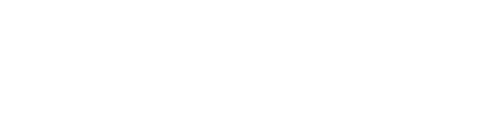
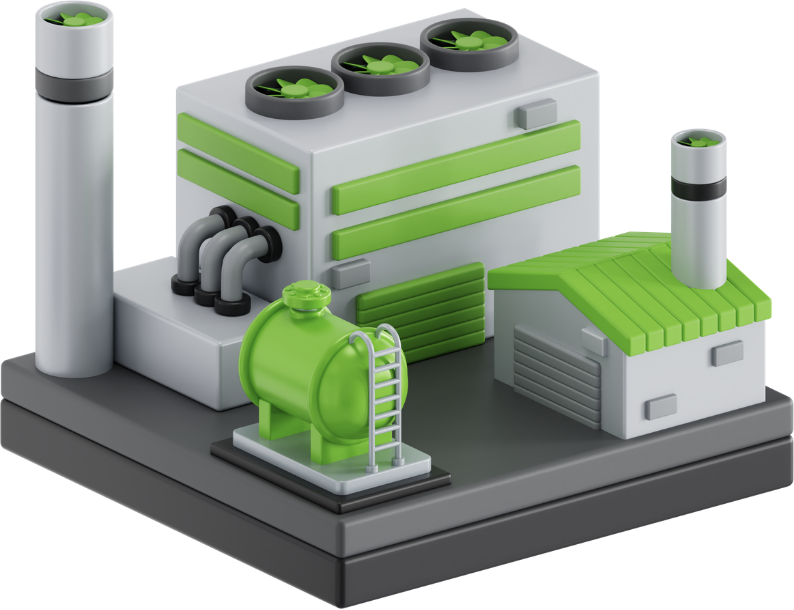
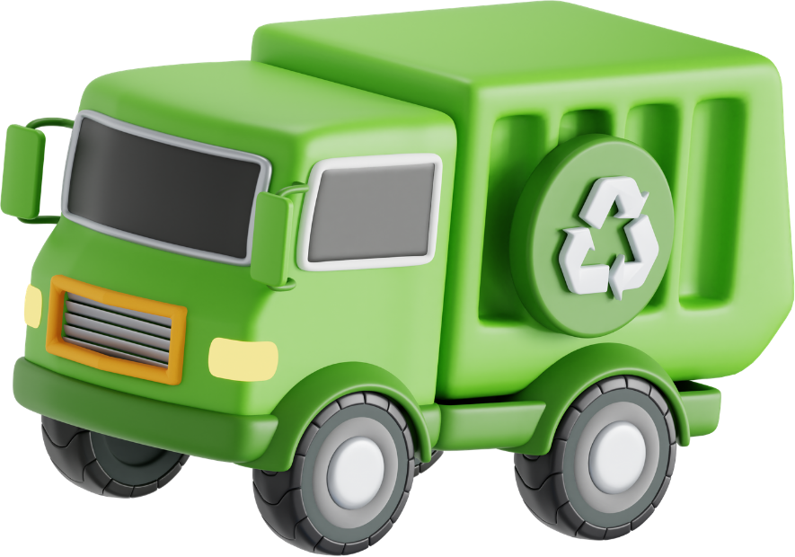
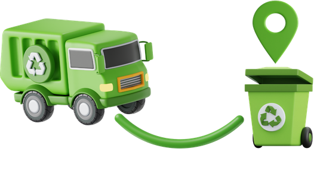

<div align="center">



# RouteWaste TFG

**Waste collection infrastructure and daily route planning platform**

### Tech Stack


</div>

---

RouteWaste is a full-stack thesis project for planning waste collection infrastructure and daily vehicle routes. The system models containers, facilities, vehicles, service assignments, and the infrastructure plan generated by the algorithm. Its goal is to support decisions such as where to place facilities, how to group containers, and how to build daily routes under budget, capacity, and service constraints.

## What This Thesis Covers

The project combines three layers:

1. A Spring Boot back-end that exposes the domain model and REST API.
2. A Vue 3 front-end that lets users manage entities and run the planning algorithm.
3. A Java algorithm module that generates the collection plan and daily routes.

The solution focuses on waste collection planning for a municipal or regional context: containers are assigned to the nearest facility, vehicles execute daily collection routes, and the final plan records costs, distances, collected waste, and container monitoring data.

## Repository Structure

| Path | Purpose |
|------|---------|
| `back-end/` | Spring Boot REST API, domain model, MongoDB persistence, Swagger, and Docker support. |
| `front-end/` | Vue 3 + TypeScript application for the user interface and E2E tests. |
| `algorithm/` | Standalone Java planning engine used by the back-end to execute the optimization logic. |
| Root `sensor-app/` | Monorepo scripts for Docker, Newman, and end-to-end test orchestration. |

## Domain Model

The core domain lives in `back-end/src/main/java/es/ull/project/domain/`. The table below summarizes the main entities used by the thesis.

### Container


| Field | Type | Required | Description |
|-------|------|----------|-------------|
| `id` | `UUID` | Yes | Immutable container identifier. |
| `name` | `Name` | Yes | Human-readable container name. |
| `location` | `Location` | Yes | Geographic position and address data. |
| `wasteType` | `WasteType` | Yes | Type of waste collected by the container. |
| `capacityLiters` | `ContainerCapacityLiters` | Yes | Maximum capacity in liters. |
| `dailyDemandLitersPerDay` | `DailyWasteDemandLitersPerDay` | Yes | Estimated daily waste generation. |
| `serviceZone` | `ServiceZone` | No | Optional service zone classification. |

### Facility



| Field | Type | Required | Description |
|-------|------|----------|-------------|
| `id` | `UUID` | Yes | Immutable facility identifier. |
| `name` | `Name` | Yes | Human-readable facility name. |
| `facilityType` | `FacilityType` | Yes | Operational base, transfer station, or treatment plant. |
| `location` | `Location` | Yes | Geographic position and address data. |
| `storageCapacity` | `StorageCapacityKilograms` | Yes | Storage capacity in kilograms. |
| `processingCapacity` | `ProcessingCapacityKilogramsPerDay` | Yes | Processing capacity per day. |
| `unloadingTime` | `UnloadingTime` | Yes | Time required to unload a vehicle. |
| `openingFixedCost` | `OpeningFixedCost` | Yes | Fixed cost of opening the facility. |
| `status` | `FacilityStatus` | Yes | Lifecycle state of the facility. |
| `currentFillingLevel` | `DailyWasteDemandLitersPerDay` | No | Calculated current filling level. |

### Vehicle



| Field | Type | Required | Description |
|-------|------|----------|-------------|
| `id` | `UUID` | Yes | Immutable vehicle identifier. |
| `name` | `Name` | Yes | Human-readable vehicle name. |
| `vehicleType` | `VehicleType` | Yes | Collection truck, transfer truck, or support vehicle. |
| `capacityKilograms` | `VehicleCapacityKilograms` | Yes | Load capacity in kilograms. |
| `capacityLiters` | `VehicleCapacityLiters` | Yes | Load capacity in liters. |
| `costPerKilometer` | `TransportationVariableCost` | Yes | Variable transport cost per kilometer. |

### ServiceAssignment

| Field | Type | Required | Description |
|-------|------|----------|-------------|
| `id` | `UUID` | Yes | Immutable assignment identifier. |
| `infrastructurePlan` | `InfrastructurePlan` | Yes | Parent infrastructure plan. |
| `facility` | `Facility` | Yes | Facility that serves the cluster. |
| `assignedContainers` | `List<Container>` | Yes | Containers grouped in the same service cluster. |

### InfrastructurePlan

| Field | Type | Required | Description |
|-------|------|----------|-------------|
| `id` | `UUID` | Yes | Immutable infrastructure plan identifier. |
| `period` | `PlanningPeriod` | Yes | Planning horizon. |
| `selectedFacilities` | `List<Facility>` | No | Facilities selected for the plan. |
| `serviceAssignments` | `List<ServiceAssignment>` | No | Container clusters assigned to facilities. |
| `dailyPlans` | `List<DailyPlan>` | No | Generated daily routes. |
| `servicePolicies` | `ServicePolicies` | Yes | Optional service restrictions. |
| `maxBudget` | `MaximumBudget` | Yes | Maximum allowed budget. |
| `estimatedTotalCost` | `TotalCost` | No | Estimated total cost of the plan. |
| `totalCollectedKilograms` | `CollectedWeightKilograms` | No | Total collected waste in kilograms. |
| `totalCollectedLiters` | `CollectedVolumeLiters` | No | Total collected waste in liters. |
| `totalDistanceMeters` | `Distance` | No | Total route distance. |
| `numberOfDays` | `NumberOfDays` | No | Planning horizon length. |
| `averagePickupTimeMinutes` | `AveragePickupTimeMinutes` | No | Average time spent at each pickup. |
| `executedAt` | `ExecutedAt` | No | Timestamp of the algorithm execution. |
| `validityState` | `InfrastructurePlanValidityState` | Yes | Whether the plan still matches current master data. |
| `executionRequestJson` | `AlgorithmJsonPayload` | No | Snapshot of the execution request. |
| `containerDailyStates` | `List<ContainerDailyState>` | No | Daily monitoring snapshots for containers. |

### DailyPlan



| Field | Type | Required | Description |
|-------|------|----------|-------------|
| `id` | `UUID` | Yes | Immutable daily plan identifier. |
| `infrastructurePlan` | `InfrastructurePlan` | Yes | Parent infrastructure plan. |
| `facility` | `Facility` | Yes | Origin and return facility. |
| `serviceDate` | `LocalDate` | Yes | Date of the route. |
| `planDay` | `PlanDay` | No | Day number inside the planning horizon. |
| `vehicle` | `Vehicle` | Yes | Assigned vehicle. |
| `totalCollectedKilograms` | `CollectedWeightKilograms` | No | Total collected weight for the route. |
| `totalCollectedLiters` | `CollectedVolumeLiters` | No | Total collected volume for the route. |
| `totalDistanceMeters` | `Distance` | No | Total route distance. |
| `stops` | `List<Stop>` | No | Ordered list of route stops. |

### Stop

| Field | Type | Required | Description |
|-------|------|----------|-------------|
| `id` | `UUID` | Yes | Immutable stop identifier. |
| `sequence` | `RouteSequence` | Yes | Order of the stop inside the route. |
| `type` | `StopType` | Yes | Container stop or facility stop. |
| `container` | `Container` | Conditional | Present when the stop is a container visit. |
| `collectedKilograms` | `CollectedWeightKilograms` | Yes | Weight collected at the stop. |
| `collectedLiters` | `CollectedVolumeLiters` | Yes | Volume collected at the stop. |
| `distanceFromPreviousMeters` | `Distance` | Yes | Distance from the previous stop. |
| `cumulativeDistanceMeters` | `Distance` | Yes | Total route distance up to this stop. |
| `containerActualLiters` | `CollectedVolumeLiters` | No | Container fill level before collection. |
| `alerts` | `List<StopAlert>` | No | Alerts generated during the stop. |

### ContainerDailyState

| Field | Type | Required | Description |
|-------|------|----------|-------------|
| `id` | `UUID` | Yes | Immutable snapshot identifier. |
| `infrastructurePlanId` | `UUID` | No | Parent plan id for legacy compatibility. |
| `containerId` | `UUID` | Yes | Referenced container id. |
| `planDay` | `PlanDay` | Yes | Day number. |
| `dailyFillingLiters` | `CollectedVolumeLiters` | Yes | Fill level for that day. |
| `containerCapacityLiters` | `ContainerCapacityLiters` | Yes | Capacity at the time of the plan. |
| `dailyDemandLitersPerDay` | `DailyWasteDemandLitersPerDay` | Yes | Expected daily demand. |
| `status` | `ContainerStatus` | Yes | Calculated state of the container. |

### StopAlert

| Field | Type | Required | Description |
|-------|------|----------|-------------|
| `type` | `StopAlertType` | Yes | Alert category. |
| `message` | `StopAlertMessage` | Yes | Human-readable message. |
| `value` | `StopAlertValue` | No | Optional numeric context. |

### Main Enums

| Enum | Values |
|------|--------|
| `WasteType` | `ORGANIC`, `PACKAGING`, `PAPER_CARDBOARD`, `GLASS`, `RESIDUAL` |
| `FacilityType` | `OPERATIONAL_BASE`, `TRANSFER_STATION`, `TREATMENT_PLANT` |
| `FacilityStatus` | `CANDIDATE`, `PLANNED`, `OPEN`, `DISCARDED` |
| `VehicleType` | `COLLECTION_TRUCK`, `TRANSFER_TRUCK`, `SUPPORT_VEHICLE` |
| `ServiceZone` | `NEIGHBORHOOD`, `DISTRICT`, `GEOGRAPHICAL_AREA` |
| `StopType` | `CONTAINER`, `FACILITY` |
| `ContainerStatus` | `CORRECT`, `OVERFLOWED` |
| `InfrastructurePlanValidityState` | `VALID`, `OBSOLETE` |
| `InfrastructurePlanStatus` | `SUBOPTIMAL`, `OVERBUDGET` |

## Algorithm Overview

The planning engine lives in `algorithm/src/main/java/com/ull/algorithm/Algorithm.java`. It receives a fully typed `DeliveryPlanningProblem` and produces a `DeliveryPlanningSolution`.

### Input

The algorithm works with:

| Input | Description |
|------|-------------|
| Facilities with vehicles | Each facility is paired with the vehicles that can operate there. |
| Containers | Containers to be served during the planning horizon. |
| Number of days | Planning horizon length. |
| Budget | Maximum allowed plan budget. |
| Start time | Collection start time for daily routes. |
| Pickup and transfer times | Time spent at each stop and between movements. |
| Greedy weights | Distance and fill weights used by the scoring function. |

### Phase 1 - Clusterization

Each container is assigned to the nearest facility. This produces a facility cluster that groups the containers that will be served from that facility.

### Phase 2 - Daily Greedy Routing

For each day, each facility cluster, and each vehicle assigned to that facility, the algorithm builds a route by repeating the following steps:

1. Add the daily demand to every container in the cluster.
2. Select the next collectable container using a greedy score.
3. Collect as much waste as the vehicle can carry, limited by both liters and kilograms.
4. Add a container stop to the daily plan and record monitoring data.
5. Return to the facility and unload when the vehicle becomes full or when the route ends.

The score used to select the next container is based on normalized distance and normalized fill percentage. Lower scores are preferred:

`score = distanceWeight * normalizedDistance - fillWeight * normalizedFill`

Containers that have already overflowed receive extra priority. When scores are tied, the algorithm prefers the container with the highest fill percentage, and then the nearest one.

### Phase 3 - Monitoring and Alerts

The algorithm stores daily container states and generates stop alerts when:

- A container is already above its nominal capacity before collection.
- The vehicle cannot collect the entire pending amount because it reaches capacity.

### Result

The output plan includes:

- Selected facilities and service assignments.
- Daily routes with ordered stops.
- Total collected waste, total distance, and estimated cost.
- Container monitoring snapshots for each planning day.
- A status such as `SUBOPTIMAL` or `INFEASIBLE` depending on the result.

## Running Locally

### Requirements

- Node.js 18 or newer.
- Java 17.
- Maven 3.9 or compatible.
- Docker Desktop or Docker Engine with Compose.
- A GitHub personal access token with `read:packages` for the private `@ull-tfg` packages.

### Back-end

```bash
cd back-end
mvn spring-boot:run
```

By default the back-end uses MongoDB at `mongodb://localhost:27017/db-application`.

Swagger UI is available at `http://localhost:8080/swagger-ui.html`.

### Front-end

```bash
cd front-end
npm install
npm run dev
```

The front-end reads the API URL from `VITE_APP_API_URL`.

## Tests

### Back-end tests

```bash
cd back-end
mvn test
```

### Front-end unit tests

```bash
cd front-end
npm install
npm run test
```

### Front-end E2E tests

```bash
cd front-end
npm run test:e2e
```

### REST API tests with Newman

```bash
cd sensor-app
npm install
npm run test:api
```

To run the full API test flow, build the JAR, start the isolated test stack, execute Newman, and stop the stack:

```bash
npm run test:api:full
```

### Useful test scripts from the root

| Script | Description |
|--------|-------------|
| `npm run postman:generate` | Regenerates `rest-api_tests.json` and `rest-api_environment.json`. |
| `npm run test:api:stack:up` | Starts the isolated API-test stack. |
| `npm run test:api:stack:down` | Stops the API-test stack. |
| `npm run test:api:wait` | Waits until the API-test back-end is ready. |
| `npm run test:e2e` | Runs Playwright against the isolated API-test back-end. |
| `npm run test:e2e:full` | Builds the JAR, starts the stack, runs E2E tests, and shuts the stack down. |

## Docker

### Environment setup

Create the root `.env` file from the example and set your GitHub token:

```bash
cp .env.example .env
```

The root `.env.example` contains the shared Docker secret needed to build the images. The front-end also has its own `front-end/.env.example` for `VITE_APP_API_URL`.

### Full stack

```bash
npm install
npm run docker:full
```

This command builds the front-end locally, builds the algorithm image, and then starts the full stack with Docker Compose.

### Stop the stack

```bash
npm run docker:full:down
```

### Services and URLs

| Service | URL |
|---------|-----|
| Front-end | `http://localhost` |
| Back-end API | `http://localhost:8080/api/v1/` |
| Swagger UI | `http://localhost:8080/swagger-ui.html` |
| MongoDB (from Docker host) | `mongodb://localhost:27018/db-application` |

## API Test Stack

The Newman and Playwright tests use an isolated MongoDB database and a dedicated back-end profile.

| Resource | Development | API test stack |
|----------|-------------|----------------|
| Back-end host port | `8080` | `8081` |
| MongoDB database | `db-application` | `db-application-api-test` |
| Spring profile | default | `api-test` |
| Compose profile | `back-end` | `api-test` |

## Environment Files

| File | Purpose |
|------|---------|
| `.env.example` | Root Docker secret template for `GITHUB_TOKEN`. |
| `front-end/.env.example` | Front-end API URL template for Vite. |

## Notes

- The algorithm image is built as `sensor-app_algorithm:latest`.
- The back-end can execute the algorithm through Docker using the host socket.
- The API-test stack does not publish the test MongoDB port to the host.
